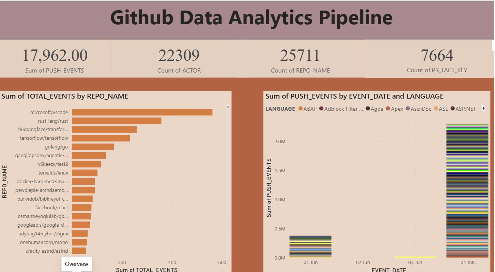
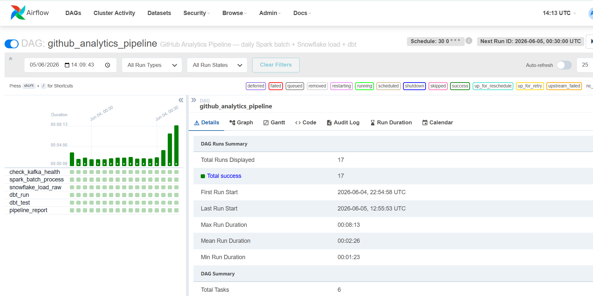
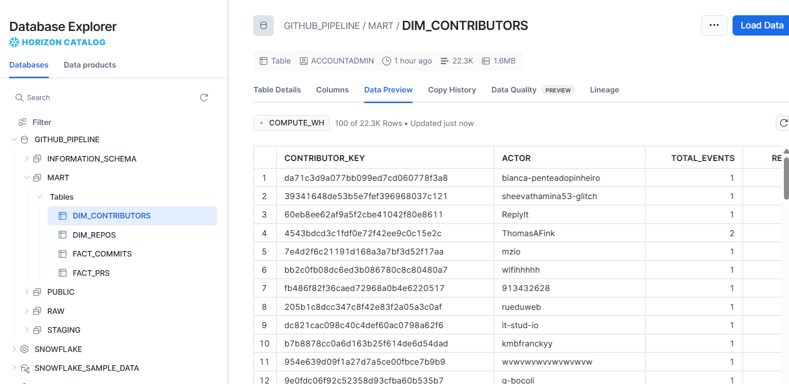

# 🐙 GitHub Analytics Pipeline

> **Data Engineering Portfolio Project** — End-to-end streaming + batch pipeline
> ingesting GitHub public events, processing through Spark, storing in a local GCS emulator,
> loading to Snowflake, and transforming with dbt into analytics-ready mart tables
> visualised in Power BI.

[](https://python.org)
[](https://kafka.apache.org)
[](https://spark.apache.org)
[](https://airflow.apache.org)
[](https://getdbt.com)
[](https://snowflake.com)
[](https://powerbi.microsoft.com)

---

## 📸 Screenshots

### Power BI Dashboard
<!-- Add dashboard screenshot here -->


### Airflow DAG
<!-- Add Airflow DAG screenshot here -->


### Snowflake Tables
<!-- Add Snowflake tables screenshot here -->


---

## 🏗️ Architecture

```
GitHub Public Events API
         │  (poll every 5s via PAT)
         ▼
 producer/github_producer.py
         │  publishes JSON to Kafka
         ▼
 Kafka topic: github-events
         │
         ├──► spark_streaming/github_to_gcs.py    (micro-batch every 30s)
         │         │  Parquet partitioned by date/hour/event_type
         │         ▼
         │    Local GCS Emulator: raw/date=YYYY-MM-DD/
         │
         └──► (Airflow @daily at 00:30 UTC)
                   │
                   ▼
         spark_batch/github_batch_processor.py
                   │  deduplicate · enrich · derive fields
                   ▼
         Local GCS Emulator: processed/date=YYYY-MM-DD/
                   │
                   ▼
         snowflake/sf_load.py        (PUT + COPY INTO)
                   │
                   ▼
         Snowflake: GITHUB_PIPELINE.RAW.RAW_GITHUB_EVENTS
                   │
                   ▼
         dbt run (staging → mart)
                   │
           ┌───────┴───────┐
           ▼               ▼
   fact_commits       fact_prs
   dim_repos          dim_contributors
                   │
                   ▼
         Power BI Desktop (Snowflake DirectQuery or Import)
```

---

## 📁 Project Structure

```
github-analytics-pipeline/
├── docker-compose.yml              # Kafka + Zookeeper + fake-gcs + Airflow + Spark
├── Dockerfile.airflow              # Custom Airflow image with dependencies
├── Dockerfile.spark                # Custom Spark image
├── .env.example                    # Credential template
├── requirements.txt                # Python dependencies
├── Makefile                        # One-command shortcuts
│
├── producer/
│   └── github_producer.py          # GitHub Events API → Kafka
│
├── spark_streaming/
│   └── github_to_gcs.py            # Kafka → local GCS raw Parquet (Spark)
│
├── spark_batch/
│   └── github_batch_processor.py   # GCS raw → GCS processed (Spark batch)
│
├── snowflake/
│   ├── schema.sql                  # DDL for RAW_GITHUB_EVENTS table
│   ├── sf_load.py                  # GCS processed → Snowflake (PUT + COPY INTO)
│   └── fix_column_types.sql        # One-time column type fixes
│
├── dbt/
│   ├── dbt_project.yml
│   ├── profiles.yml                # dev=DuckDB  prod=Snowflake
│   ├── packages.yml
│   └── models/
│       ├── staging/
│       │   ├── _sources.yml
│       │   ├── stg_github_events.sql
│       │   ├── stg_push_events.sql
│       │   ├── stg_pr_events.sql
│       │   └── stg_watch_events.sql
│       └── mart/
│           ├── _schema.yml
│           ├── fact_commits.sql
│           ├── fact_prs.sql
│           ├── dim_repos.sql
│           └── dim_contributors.sql
│
├── airflow/
│   └── dags/
│       └── github_analytics_dag.py # Daily: Spark → Snowflake load → dbt run → dbt test
│
└── dashboard/
    └── export_for_powerbi.py       # Exports Snowflake mart tables to CSV for Power BI
```

---

## 🚀 Quick Start

### Prerequisites

| Tool | Version | Notes |
|------|---------|-------|
| Docker Desktop | Latest | [docker.com](https://docker.com) |
| Python | 3.11+ | [python.org](https://python.org) |
| Snowflake Account | Free trial | [snowflake.com](https://snowflake.com) |

### Step 1 — Configure credentials

```powershell
copy .env.example .env
```

Fill in your `.env`:
```env
GITHUB_TOKEN=ghp_yourtoken
SNOWFLAKE_ACCOUNT=your-account-id
SNOWFLAKE_USER=your-username
SNOWFLAKE_PASSWORD=your-password
SNOWFLAKE_DATABASE=GITHUB_PIPELINE
SNOWFLAKE_WAREHOUSE=COMPUTE_WH
```

### Step 2 — Start infrastructure

```powershell
docker-compose up -d
# Wait ~90 seconds for all services to become healthy
```

Services started:
- **Kafka** `localhost:9092`
- **fake-gcs-server** `localhost:4443`
- **Airflow** `http://localhost:8081` (admin / admin)
- **Spark Master** `http://localhost:8082`

### Step 3 — Set up Snowflake schema

```powershell
docker exec github_airflow_webserver python snowflake/sf_load.py --setup-only
```

### Step 4 — Run the pipeline

Airflow runs automatically at **00:30 UTC daily**. To trigger manually:

```powershell
# Trigger DAG from Airflow UI at http://localhost:8081
# Or run steps individually:
docker exec github_airflow_webserver python snowflake/sf_load.py --date 2026-06-04
docker exec github_airflow_webserver bash -c "cd /opt/airflow/dbt && dbt run --target prod --profiles-dir ."
```

---

## 🔄 Daily Batch Pipeline (Airflow DAG)

Schedule: `30 0 * * *` (00:30 UTC daily)

```
check_kafka_health
       │
       ▼
spark_batch_process    ← processes yesterday's raw GCS Parquet
       │
       ▼
snowflake_load_raw     ← PUT + COPY INTO Snowflake RAW table
       │
       ▼
dbt_run                ← dbt run --target prod
       │
       ▼
dbt_test               ← dbt test --target prod
       │
       ▼
pipeline_report        ← always runs, logs summary
```

---

## 🔧 dbt Models

| Model | Type | Description |
|-------|------|-------------|
| `stg_github_events` | View | All events, typed & cleaned |
| `stg_push_events` | View | PushEvents with commit metadata |
| `stg_pr_events` | View | PR lifecycle events |
| `stg_watch_events` | View | Star events |
| `fact_commits` | Table | One row per push event |
| `fact_prs` | Table | One row per PR event (open/closed/merged) |
| `dim_repos` | Table | One row per repo (latest snapshot + activity rollup) |
| `dim_contributors` | Table | One row per GitHub actor |

**Dev (local DuckDB):**
```powershell
cd dbt && dbt run --target dev --profiles-dir .
```

**Prod (Snowflake):**
```powershell
cd dbt && dbt run --target prod --profiles-dir .
```

---

## 📊 Dashboard (Power BI)

Connect Power BI Desktop directly to Snowflake:

1. Home → Get Data → **Snowflake**
2. Server: `<account>.snowflakecomputing.com`
3. Database: `GITHUB_PIPELINE` / Schema: `MART`
4. Load tables: `DIM_REPOS`, `DIM_CONTRIBUTORS`, `FACT_COMMITS`, `FACT_PRS`
5. Switch to **Import mode** for faster dashboards

Suggested visuals:
- **KPI cards** — total push events, contributors, repos, PRs
- **Bar chart** — top repos by total events
- **Line chart** — daily push events by language
- **Donut chart** — PR status breakdown (open / closed / merged)
- **Table** — contributor leaderboard
- **Scatter chart** — stars vs activity per repo

---

## 📦 Tech Stack

| Layer | Technology |
|-------|------------|
| **Data Source** | GitHub Public Events API |
| **Streaming Ingestion** | Apache Kafka (Confluent 7.6) |
| **Stream Processing** | Apache Spark Structured Streaming 3.5 |
| **Object Storage** | fake-gcs-server (local GCS emulator) |
| **Batch Processing** | Apache Spark Batch 3.5 |
| **Data Warehouse** | Snowflake (RAW + MART schemas) |
| **Transformations** | dbt (Snowflake adapter + DuckDB dev adapter) |
| **Orchestration** | Apache Airflow 2.9 |
| **Dashboard** | Power BI Desktop (Snowflake connector) |
| **Containerisation** | Docker + Docker Compose |

---

*Built as a Data Engineering portfolio project demonstrating end-to-end streaming with Kafka, batch processing with Spark, cloud warehousing with Snowflake, data transformation with dbt, orchestration with Airflow, and dashboarding with Power BI.*
